<strong>Applied ML · Agentic systems · Research that ships</strong>

<a href="https://just-sree.vercel.app">Explore my portfolio ↗</a> &nbsp; · &nbsp; <a href="https://just-sree.vercel.app/#contact">Talk to my agent ↗</a> &nbsp; · &nbsp; <a href="https://just-sree.vercel.app/resume.pdf">Resume ↗</a> &nbsp; · &nbsp; <a href="https://linkedin.com/in/sreesankaranc">LinkedIn ↗</a>

I'm **Sree Sankaran Chackoth**, an applied ML and agentic AI engineer in Ottawa. I build AI systems that reason, automate, deploy, and solve real problems: computer vision and OCR pipelines, forecasting systems, and multi-agent workflows with inspectable outputs.

The portfolio tells the story as you scroll. The agent answers questions about it.

## IRCC · Forecasting What Comes Next

**Capstone project · September 2024–April 2025**

A time-series forecasting pipeline for Canadian immigration planning. Python ETL prepares category-level data; **Prophet, ARIMA, and Exponential Smoothing** are evaluated across multiple forecasting horizons.

The supplied resume reports **2M+ records processed** and **15+ immigration categories covered**. This was capstone work, with an emphasis on data quality, model comparison, and planning forecasts.

[Follow the story ↗](https://just-sree.vercel.app/#ircc) · [Resume source ↗](https://just-sree.vercel.app/resume.pdf)

## BogdAI · Contract Risk, With Receipts

**Microsoft Agents League Hackathon 2026 · Team prototype · Reasoning Agents Track**

A six-agent pipeline for **synthetic healthcare and pharma contracts**: intake → clause extraction → grounding → risk reasoning → verification → reporting.

Microsoft Foundry supports policy grounding and reasoning. Structured Pydantic reports bring together **citations, human-review flags, and an agent trace**. A deterministic fallback supports local demonstrations. This is a team prototype; individual contributions are not separately documented here.

[Explore the repository ↗](https://github.com/anunjinb/bogdai-contract-risk-agent) · [Follow the architecture ↗](https://just-sree.vercel.app/#bogdai)

## More work

Learning exercises, exploratory studies, and useful tools. Each repository gives the scope of the project.

### AI tools

| Project | What it explores |
| :--- | :--- |
| **[SceneSense · See It. Hear It.](https://github.com/just-sree/Object-Detection-using-HF)** | Object detection, bounding boxes, scene descriptions, and optional multilingual audio in a Gradio app. |
| **[Read Less. Listen More.](https://github.com/just-sree/AI-text-to-voice-summary-converter)** | An LLM workflow that summarises raw text or documents and converts the summary into audio. |
| **[Code, Explained.](https://github.com/just-sree/ai-code-doc-generator)** | An AI-powered code documentation generator exploring how language models can make source code easier to understand. |

### Predictive systems

| Project | What it explores |
| :--- | :--- |
| **[Retention Intelligence](https://github.com/just-sree/Churn-Forecasting-and-Strategic-Retention-Using-Data-Analytics---A)** | A customer-churn study combining predictive analytics with a proposed retrieval-augmented workflow for personalised retention strategies. |
| **[Border Traffic · Signals & Outliers](https://github.com/just-sree/Advanced-Anomaly-Detection-in-Canadian-Border-Traffic)** | Statistical and machine-learning approaches to detecting unusual traveller volumes at Canadian ports of entry. |
| **[Crypto · Beyond the Price Chart](https://github.com/just-sree/CryptoForecasts)** | An exploratory time-series project using Prophet and historical cryptocurrency data to study price trends. |
| **[Property Price Intelligence](https://github.com/just-sree/Real-Estate-Price-Prediction-using-Random-Forest)** | A random-forest regression study exploring the relationship between property features and real-estate prices. |
| **[Admissions · A Neural Perspective](https://github.com/just-sree/Neural-Network-Predicting-Chances-of-Admission-at-UCLA-)** | A neural-network modelling exercise estimating UCLA admission chances from applicant features. |
| **[Loan Eligibility · Model to Decision](https://github.com/just-sree/Loan-Eligibility-Model)** | A machine-learning exercise exploring loan-eligibility classification from applicant data. |
| **[Credit Eligibility · Applied ML](https://github.com/just-sree/credit_eligibility_application)** | An application-oriented machine-learning exercise for credit-eligibility prediction. |

### Data intelligence

| Project | What it explores |
| :--- | :--- |
| **[Retail Intelligence · The Data Blueprint](https://github.com/just-sree/Retail-Intelligence-Architecture--A-Data-Modeling-Framework-for-Walmart-Canada)** | A dimensional-modelling framework for a Walmart Canada retail case study, spanning sales, inventory, eCommerce, real estate, and employee benefits. |
| **[Customer Patterns · Uncovered](https://github.com/just-sree/Mall-Customer-Segmentation-Model-using-Clustering)** | A clustering study that groups mall customers by shared characteristics to explore customer segments. |
| **[Pistachio Quality · Finding the Odd One Out](https://github.com/just-sree/Anomaly_Detection_and_Classification_for_Pistachio_Datasets)** | Anomaly-detection and classification experiments comparing differently processed pistachio datasets. |

## Work in progress

| Project | Direction |
| :--- | :--- |
| **[OCR Proofkit](https://github.com/just-sree/ocr-proofkit)** | Quality assessment and correction for the text that OCR gets almost right. |
| **[Quota Journal](https://github.com/just-sree/quota-journal)** | A small tool for understanding API usage, request quotas, and rate limits. |
| **[Quantisation Demystified](https://github.com/just-sree/Quantization-Demystified)** | Exploring how smaller model representations trade precision for speed and memory. |

## The thread through the work

- **Algonquin Applied Research:** technical research, proposals, stakeholder coordination, and evaluation plans.
- **Lambton College:** industry-partnered applied AI research: model development, synthetic data, benchmarking, error analysis, and cloud inference.
- **Education:** Algonquin College post-graduate certificates in AI Software Development and BI Systems Infrastructure, with forecasting and classification capstones; B.Tech in Electronics & Communication Engineering, Presidency University.

**Tools I work with:** Python · PyTorch · TensorFlow · scikit-learn · Hugging Face · SQL · LangChain · Microsoft Foundry · FastAPI · Docker

---

Have a role, a workflow, or a product worth building? **[Talk to my agent](https://just-sree.vercel.app/#contact)** or **[email me](mailto:sreechackoth@gmail.com)**.
